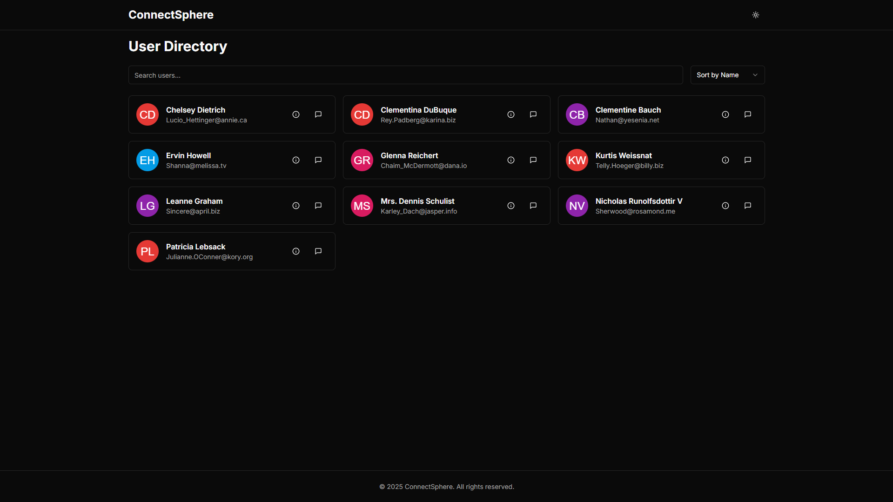

# Users & Posts Dashboard



A modern dashboard for exploring users and their blog posts, featuring smooth animations and responsive design.

## 🚀 Features

- **User Management**

  - Dynamic user cards with avatar and key info
  - Search users by name/email
  - Sort by name or company
  - Loading spinners and error states

- **Post Interactions**

  - Click-to-view user posts
  - Clean post card design
  - Responsive post grid layout

- **Enhanced UX**
  - Framer Motion animations
  - Mobile-first responsive design
  - Client-side navigation
  - Type-safe API handling

## 🛠 Tech Stack

**Core**

- Next.js (App Router)
- TypeScript

**Styling & UI**

- Tailwind CSS
- shadcn-inspired components
- Lucide React Icons

**Utilities**

- Framer Motion (Animations)
- Axios (HTTP Client)
- React Query (Data Fetching)

## 📦 Installation

1. Clone the repository:

   ```bash
   git clone <https://github.com/PriyanshuGupta28/ConnectSphere.git>
   ```

2. Install dependencies

   ```bash
   npm install

   ```

3. Start development server

   ```bash
   npm run dev

   ```

4. Open in browser
   <http://localhost:3000>

🌐 API Integration
Data Sources

```bash
Users: GET <https://jsonplaceholder.typicode.com/users>
```

```bash
Posts: GET <https://jsonplaceholder.typicode.com/posts>
```

Patterns

Client-side data fetching

Dynamic route handling

Error boundary management

📂 Project Structure

```bash
ConnectSphere/
├── app/
│ ├── layout.tsx # Root layout
│ ├── page.tsx # Homepage
│ └── users/
│ ├── [id]/ # Dynamic user route
│ │ └── page.tsx
├── components/ # Reusable UI
├── hooks/  # Reusable hooks
├── lib/ # API utilities
├── styles/ # Global CSS
└── tailwind.config.js # TW configuration

```

📄 License
Distributed under the MIT License. See LICENSE for more information.

Made with ❤️ by Priyanshu Gupta | Portfolio <https://thepriyanshu.vercel.app/>
Give a ⭐️ if you find this project interesting!
